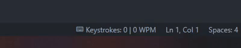

<a name="readme_top"></a>
# VSCode Keystrokemanager Extension
[![Contributors][contributors_shield]][contributors_url]
[![Forks][forks_shield]][forks_url]
[![Stargazers][stars_shield]][stars_url]
[![Issues][issues_shield]][issues_url]
<br>

[![Typescript][typescript_shield]][typescript_url]
[![VSCode-API][vscode_api_shield]][vscode_api_url]

## 📑 About the project
* tracking your keystrokes, while coding your projects
* analytics, about which keys were pressed the most
* showing your current WPM, that updates every second
<p align="right">(<a href="#readme_top">back to top</a>)</p>

## 🔥 Features
### 👍🏻 Keep track of your total keystrokes and wpm

### 👍🏻 Show analytics


<p align="right">(<a href="#readme_top">back to top</a>)</p>

## ☁ Download
Visual Studio Marketplace: @todo
<p align="right">(<a href="#readme_top">back to top</a>)</p>

## 🔢 Getting started
1. Clone the repository
   ```sh
   git clone https://github.com/MhouneyLH/keystrokemanager.git
   ```
2. Install the npm packages
   ```sh
   npm install
   ```
<p align="right">(<a href="#readme_top">back to top</a>)</p>

## 👨🏻‍💼 Contributing
Contributions are always welcome! 😃 All you have to do is:

1. Fork the project.
2. Pick or create an [issue](https://github.com/MhouneyLH/keystrokemanager/issues) you want to work on.
2. Create your Feature-Branch. (`git checkout -b feat/best_feature`)
3. Commit your changes. (`git commit -m 'feat: add some cool feature'`)
4. Push to the branch. (`git push origin feat/best_feature`)
5. Open a Pull-Request into the Develop-Branch.
<p align="right">(<a href="#readme_top">back to top</a>)</p>

<!-- Links and Images -->
[contributors_shield]: https://img.shields.io/github/contributors/MhouneyLH/keystrokemanager.svg?style=for-the-badge
[contributors_url]: https://github.com/MhouneyLH/keystrokemanager/graphs/contributors
[forks_shield]: https://img.shields.io/github/forks/MhouneyLH/keystrokemanager.svg?style=for-the-badge
[forks_url]: https://github.com/MhouneyLH/keystrokemanager/network/members
[stars_shield]: https://img.shields.io/github/stars/MhouneyLH/keystrokemanager.svg?style=for-the-badge
[stars_url]: https://github.com/MhouneyLH/keystrokemanager/stargazers
[issues_shield]: https://img.shields.io/github/issues/MhouneyLH/keystrokemanager.svg?style=for-the-badge
[issues_url]: https://github.com/MhouneyLH/keystrokemanager/issues
[typescript_shield]: https://img.shields.io/badge/TypeScript-007ACC
[typescript_url]: https://github.com/microsoft/TypeScript
[vscode_api_shield]: https://img.shields.io/badge/Made%20for-VSCode-1f425f.svg
[vscode_api_url]: https://code.visualstudio.com/api/references/vscode-api